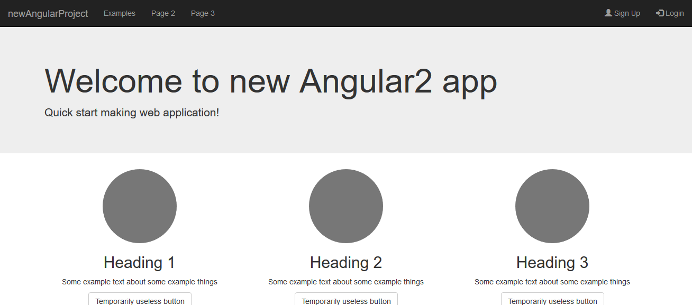

# ASP.net Core Angular 2 Yeoman generator

> Starter kit for all who want to use ASP.net Core with Angular 2

Welcome to ASP.net Core Angular 2 template!

## Technical details about this template: ##

[Everything can be found here](https://github.com/piotrek-k/generator-aspnet-angular2/blob/master/generators/app/templates/src/Angular2Template/README.md)

### Used technologies: ###

* ASP.net Core (with WebAPI) - for backend management
* Angular 2 (RC 4) - for frontend management
* TypeScript - because it works much better with Angular than pure JS
* Gulp - for all automation
* Bootstrap - for better appearance
* Entity Framework - for database management
* OpenIddict - authentication process

## Installation

> npm install -g generator-dotnetcore-angular2-starterkit

## Generating new project

> yo dotnetcore-angular2-starterkit

## After installation:

[Check out project README.](https://github.com/piotrek-k/generator-aspnet-angular2/blob/master/generators/app/templates/src/Angular2Template/README.md) **Read this if you have any doubts, questions or problems.** You can find it in every project you generate using this template.

## License

Apache-2.0 © [Piotrek]()
